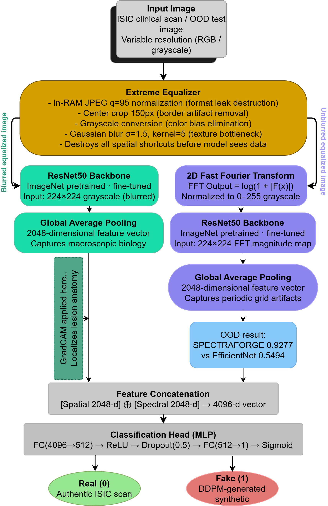
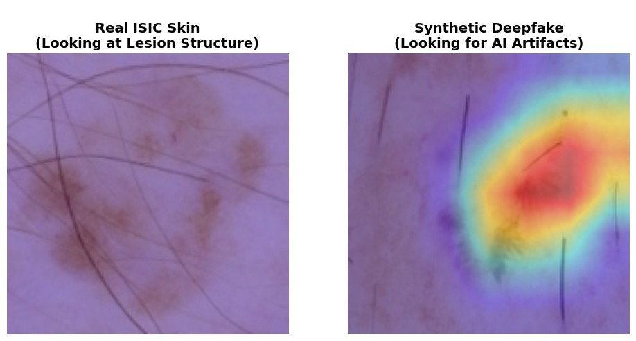
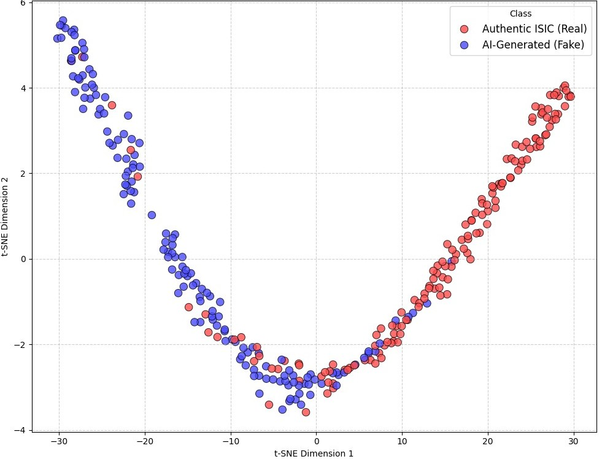

# SPECTRAFORGE: Domain-Equalized Frequency-Spatial Fusion

[](https://pytorch.org/)
[](https://opensource.org/licenses/MIT)

Official PyTorch implementation of **"SPECTRAFORGE: Domain-Equalized Frequency-Spatial Fusion for Synthetic Dermatology Detection"**.

## Abstract
Spatial deepfake detectors in medical imaging typically exploit dataset-level flaws (JPEG compression history, edge statistics, color biases) rather than identifying authentic generative footprints. Consequently, these models suffer severe performance degradation when evaluated on images from unseen generators. 

To address this vulnerability, we introduce **SPECTRAFORGE**, a two-stream CNN framework that explicitly decouples the detection task. A Gaussian-bottlenecked spatial stream isolates macroscopic lesion morphology, while a parallel FFT-magnitude stream maps the periodic upsampling artifacts inherently produced by diffusion decoders. Prior to training, our Extreme Equalizer preprocessing pipeline systematically eliminates dataset spatial leakage.

<p align="center">
  
</p>

## Key Results

SPECTRAFORGE maintains robust detection capabilities under Out-Of-Distribution (OOD) stress testing, preventing the catastrophic domain collapse seen in standard architectures.

| Model | Input Domain | Peak ID AUC | OOD Stress Test AUC |
| :--- | :--- | :--- | :--- |
| Random Forest | Flattened 2D-FFT | 0.8701 | - |
| ResNet-50 | Frequency-only (FFT) | 0.9300 | - |
| EfficientNet-B0 | Spatial SOTA | 0.9971 | 0.5494 *(Catastrophic Collapse)* |
| **SPECTRAFORGE** | **Spatial + FFT Fusion** | **0.9985** | **0.9277** |

### Interpretability: Dual-Stream Grad-CAM & Latent Space
Grad-CAM analysis confirms that the spatial stream focuses on macroscopic biological morphology, while the frequency stream captures the synthetic grid artifacts. The t-SNE projection proves that SPECTRAFORGE clusters real and synthetic images cleanly, independent of generator style shifts.

<p align="center">
  
  
</p>

## Repository Structure
* `dataset.py`: Extreme Equalizer transforms, 2D-FFT extraction, and PyTorch Dataset classes.
* `models.py`: Dual-Stream ResNet50 architecture and EfficientNet-B0 baseline.
* `train.py`: Multi-seed rigorous training loop with BCE loss.
* `evaluate_ood.py`: OOD stress testing via noise injection and t-SNE visualization generation.

## Usage
Clone the repository and install dependencies:
```bash
git clone [https://github.com/amankumar12S/SPECTRAFORGE.git](https://github.com/amankumar12S/SPECTRAFORGE.git)
pip install -r requirements.txt
